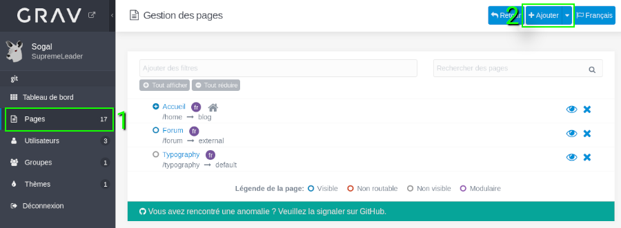
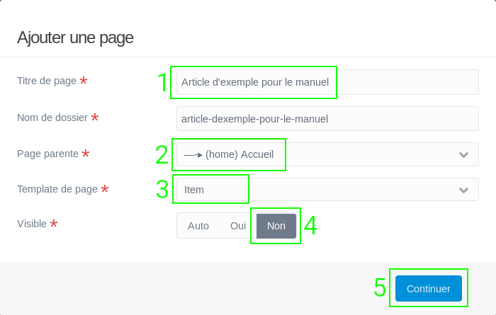
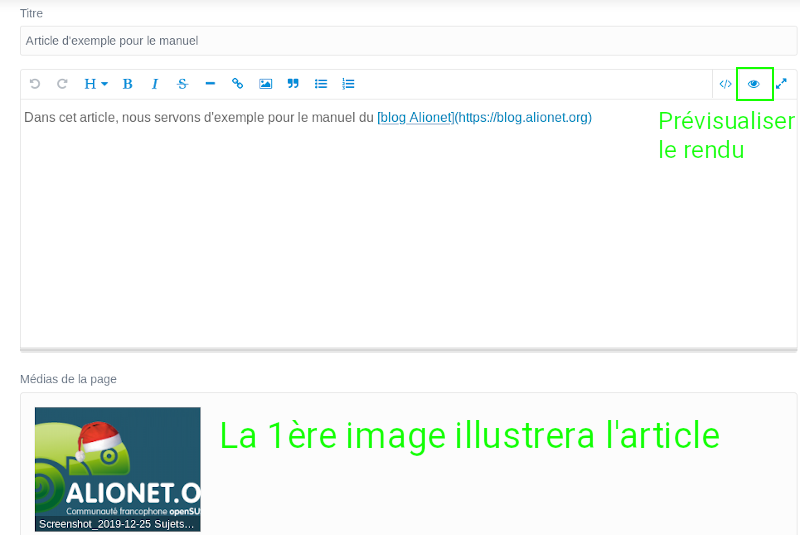
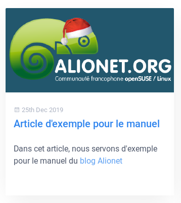

# Manuel du rédacteur Alionet

## Généralités

Depuis la refonte de novembre 2019, Alionet dispose d'un [forum](https://www.alionet.org) et d'un [blog](https://blog.alionet.org) séparés.
Le moteur du blog est [Grav](https://getgrav.org), un CMS simple, utilisant PHP mais dont la configuration se fait en fichier *Yaml* et dont les articles sont écrits en *Markdown*, un langage à balise très simple à utiliser.
Pour le markdown voir [l'article dédié](./ecrire_en_markdown.md.)

La rédaction des articles peut se faire de 2 façons différentes:

* directement depuis [l'interface de rédaction](https://blog.alionet.org/admin)
* depuis votre poste puis en *poussant* votre article sur le [dépôt Git](https://github.com/alionetasso/blog) de l'association Alionet

Pour une courte introduction à Git voir [l'article dédié](./utiliser_git.md).

## Annoncer son futur travail sur la liste de diffusion

**Cette étape est extrêmement importante pour éviter la duplication du travail !!**
Vous avez envie de contribuer à openSUSE et Alionet en rédigeant ou en traduisant un article ? Merci beaucoup, mais afin de coordonner les efforts, il y a quelques règles à respecter.
La première d'entre elle consiste à s'abonner à la liste de diffusion [opensuse-translation-fr](https://lists.opensuse.org/opensuse-translation-fr/). C'est sur cette liste que les autres rédactrices et rédacteurs échangent et se tiennent mutuellement au courant de ce sur quoi elles ou ils travaillent.
Lorsque vous avez choisi un sujet pour rédiger un article ou bien, et surtout, lorsque vous vous apprêtez à traduire un article paru sur [news.opensuse.org](https://news.opensuse.org), il faut vérifier que personne n'a annoncé déjà son intention de le faire.
Si ce n'est pas le cas, vous devez envoyer un mail à la liste de diffusion en indiquant ce sur quoi vous allez travailler et la date estimée de publication.

## Écrire un article depuis l'interface Web

Pour pouvoir se connecter, il faut disposer d'un compte rédacteur (en faire la demande à un administrateur) et se rendre à l'adresse [https://blog.alionet.org/admin](https://blog.alionet.org/admin).

* Cliquer ensuite sur le lien **Pages** dans la barre latérale à gauche

* Cliquer sur **Ajouter** dans la barre supérieure, à droite

* Dans le menu de création qui s'affiche, il convient de renseigner les éléments et options suivants:

    * Le titre de la page: c'est le nom de votre article
    * Le nom du dossier: il a été déduit automatiquement du nom de l'article, c'est dans ce dossier que Grav va ranger l'article sur le serveur, vous n'avez pas à vous en soucier
    * Page parente: il faut sélectionner **(home) Accueil**
    * Template de page: il faut choisir **Item**
    * Visible: Cliquer sur **Non**, sans cela l'article sera visible dans le menu du blog alors que nous voulons qu'il soit créé comme *enfant* de la page principale

* Une fois les paramètres ci-dessus validés, nous allons pouvoir commencer la rédaction de l'article:

Le format employé est le [Markdown](https://commonmark.org/help/), se référer à ce lien pour voir les balises à utiliser.
Pour ajouter une image d'en-tête de l'article, pas besoin de l'ajouter via un lien, il suffit d'enregister une première fois votre article pour que Grav vous permette de l'ajouter.

La première image trouvée sera automatiquement utilisée en tant qu'illustration de l'article. Il n'est pas non plus nécessaire de mettre un titre à l'article, Grav s'en charge.
Une fois l'article rédigé, il suffit de l'enregistrer pour qu'il soit visible en ligne sur la page d'accueil du blog. Vous pouvez contrôler le rendu final en cliquant sur l'icône **Œil** dans la barre de mise en forme.

Il faut savoir que lorsque vous enregistrer votre travail, Grav va automatiquement le pousser dans le dépôt Git.

L'article est ensuite disponible:

